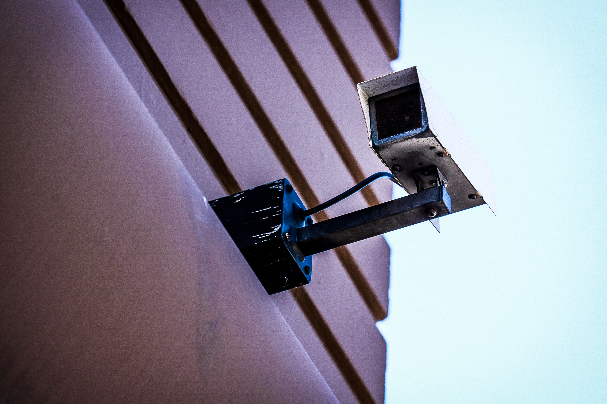
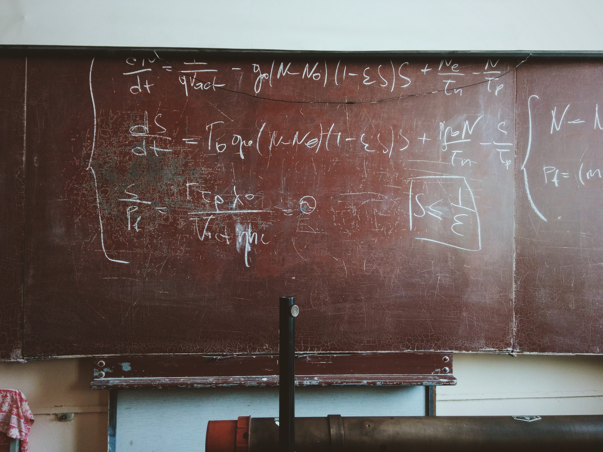
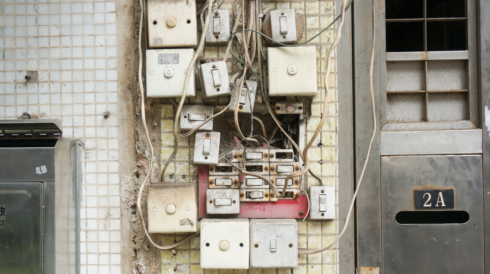

# [fit] Notify Me, Notify You.
# [fit] Aha!
## User notifications in iOS 10
### Sam Davies [@iwantmyrealname](https://twitter.com/iwantmyrealname)

---


# [fit] hi,
# [fit] i'm sam

---

# What are user notifications?

---


# [fit] Not to be confused with
# [fit] notification
# [fit] centre

---


# Problems with ye olde way

- Conflated source and display
- Operating in a vacuum
- Evolved _not_ designed
- Manual _in-app_ display

---


# The `UserNotifications` Framework

- Fixes the issues
- Query for permission status
- Management of local notifications
- Custom UI
- Mutate push notifications

---



# Authorisation

- Still have to request for remote notifications


---
# Authorisation

```swift
UNUserNotificationCenter
  .current()
  .requestAuthorization(options: [.alert, .sound]) {
    (granted, error) in
    if granted {
      self.loadNotificationData()
    } else {
      print(error?.localizedDescription)
    }
}
```

---


# [fit] Scheduling

---


# Scheduling

- Push notifications
- Time interval
- Calendar
- Geofence

---
# Notification Content

```swift
let attachment =
  try! UNNotificationAttachment(identifier: randomImageName,
                                url: imageURL, options: .none)
    
  let content = UNMutableNotificationContent()
  content.title = "New cuddlePix!"
  content.subtitle = "What a treat"
  content.attachments = [attachment]
  content.body = "Cheer yourself up with a hug 🤗"
  content.categoryIdentifier = newCuddlePixCategoryName
```

---
# Triggers & Requests

```swift
let trigger =
  UNTimeIntervalNotificationTrigger(timeInterval: inSeconds,
                                    repeats: false)
    
  let request =
    UNNotificationRequest(identifier: randomImageName,
                          content: content, trigger: trigger)
  
  UNUserNotificationCenter
    .current()
    .add(request, withCompletionHandler: {
      (error) in
      if let error = error {
        print(error)
      }
      completion()
  })
```


---


# [fit] Management


---
# Management

```swift
open class UNUserNotificationCenter : NSObject {
  
  ...

  // SETTINGS
  open func getNotificationSettings(
    completionHandler: @escaping (UNNotificationSettings) -> ())

  ...

```

---
# Management

```swift
  ...

  // PENDING
  open func getPendingNotificationRequests(
    completionHandler: @escaping ([UNNotificationRequest]) -> ())

  open func removePendingNotificationRequests(
    withIdentifiers identifiers: [String])

  open func removeAllPendingNotificationRequests()

  ...
```

---
# Management

```swift
  ...

  // DELIVERED
  open func getDeliveredNotifications(
    completionHandler: @escaping ([UNNotification]) -> ())

  open func removeDeliveredNotifications(
    withIdentifiers identifiers: [String])

  open func removeAllDeliveredNotifications()
}


```

---


# [fit] In-App Delivery

---
# In-App Delivery

```swift
UNUserNotificationCenter.current().delegate = self
```

Implement the delegate method:

```swift
func userNotificationCenter(_ center: UNUserNotificationCenter, willPresent notification: UNNotification, withCompletionHandler completionHandler: @escaping (UNNotificationPresentationOptions) -> Swift.Void {
  completionHandler(.alert)
}
```

---
# In-App Delivery

```swift
UNUserNotificationCenter.current().delegate = self
```

Implement the delegate method:

```swift
func userNotificationCenter(
  _ center: UNUserNotificationCenter,
  willPresent notification: UNNotification,
  withCompletionHandler completionHandler:
    @escaping (UNNotificationPresentationOptions) -> ()) {

      completionHandler(.alert)
}
```


---


# [fit] demo


---


# [fit] Custom UI

---


# [fit] Interactivity


---
# [fit] demo


---
# Intercepting push notifications

- via the Service Extension point
- Think of it as a `.filter()` operation


---

# [fit] demo


---
# Summary

- Central place for all (user) notification goodness
- Can query settings and manage enqueued local notifications
- Extend user experience with custom notification UI
- Enhance push notifications with service extensions

---


# Make the switch

## _well, if you can_

- iOS 10 only

[github.com/sammyd](github.com/sammyd)
[@iwantmyrealname](twitter.com/iwantmyrealname)


